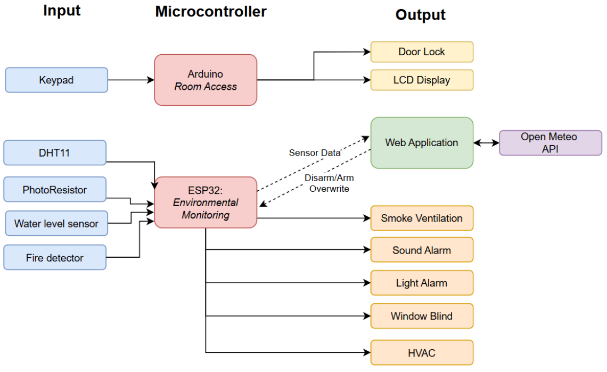
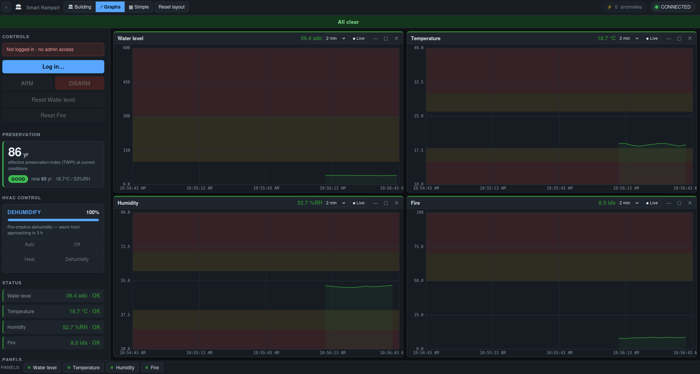
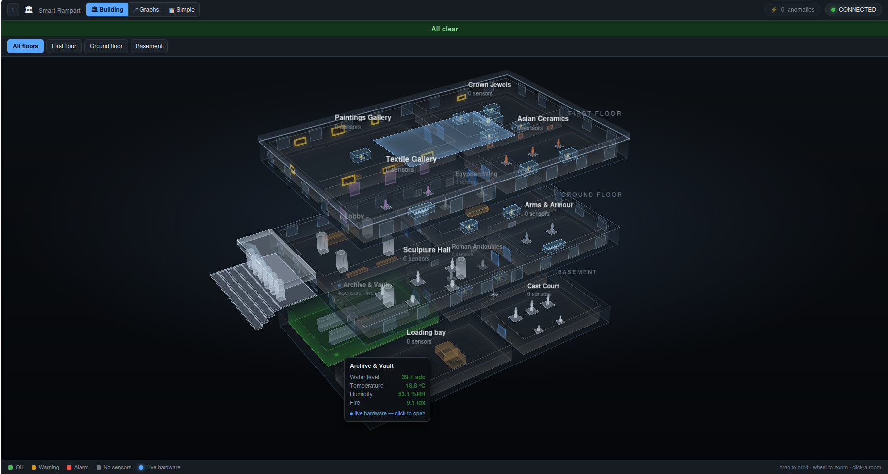

<p align="center">
  
</p>

<h1 align="center">Smart Rampart</h1>

<p align="center">
  <em>Environmental &amp; security monitoring for museums, archives and cultural-heritage storage.</em><br>
  <strong>Secured Access Control · Preventive Preservation · Disaster Warning System</strong>
</p>

---

## The story

*A "rempart" is the protective, defensive wall around a castle. We set out to build a modern one — for art.*

In October 2025 thieves walked out of the **Louvre** with an estimated **€88 million** in
jewels. But theft is only the loud failure. Every day, quietly, collections are lost to the
*undramatic* enemies: a humid week that warps a canvas, a slow leak in a basement archive, a
light fixture left too bright over a pigment, a fire in a room where you can't use water to
put it out. Museums care as much about **decay** as they do about break-ins.

Smart Rampart was built over a **10-hour hackathon** by a five-person team (Team 1 — Raluca,
Giang, Lennard, Helena, Alexandra). We were handed a **maker's kit** — an **Arduino Uno R3**,
an **ESP32**, a **Raspberry Pi Pico**, a breadboard, and a drawer of sensors and actuators
(DHT11 temp/humidity, a water-level probe, a photoresistor, a potentiometer standing in for a
flame sensor, a 4×4 keypad, an I²C LCD, a micro-servo, LEDs and a buzzer). No cloud, no budget,
one hotspot. The challenge: turn a pile of components into something a real museum could
plausibly deploy for a few dollars per room.

What came out is a small system with an outsized brain: cheap microcontroller nodes watching
the physical world, reporting to a **zero-install dashboard** on a security guard's laptop that
not only shows what's happening now, but **predicts** what's coming — pre-emptively conditioning
the air before a forecast humid front arrives, and estimating how many **years of life** the
current conditions are buying (or costing) the collection.

---

## What it is

Smart Rampart is a **two-tier monitoring system**:

- **Sensor nodes** (microcontrollers) sit in the rooms and watch the environment. They raise
  local alarms (LED / buzzer / servo-locked door) and report readings to the dashboard.
- **A dashboard server** runs on an ordinary laptop. It shows live status, keeps a local log,
  lets an authenticated guard **ARM / DISARM / Reset** alarms, and runs the predictive brains
  (HVAC feedforward, preservation index, anomaly detection).

<p align="center">
  
</p>

There are two independent microcontroller roles:

| Node | Board | Watches / does |
|---|---|---|
| **Environmental monitoring** | **ESP32** (WiFi) | Water level, temperature, humidity, fire index → POSTs to the dashboard over WiFi; drives HVAC effort, ventilation, and sound/light alarms. |
| **Room access control** | **Arduino Uno** | A 4×4 **keypad** unlocks a door via a **servo**; an I²C **LCD** and RGB LED show granted/denied. Standalone, local. |

## Features

**Environmental monitoring & alerting**
- Live **water level, temperature, humidity and fire** for the basement zone, updated ~every 2 s.
- **Latching** water and fire alarms — once tripped they stay tripped (so an evaporated puddle
  or a passed flame doesn't hide the event) until a guard explicitly Resets them.
- Full-screen **fire alert** popup with an *Acknowledge & DISARM* button that silences the node.
- **Heartbeat watchdog**: a node that stops reporting flips its tiles to **DISCONNECTED** within
  ~6 s instead of showing stale data as if it were live.

**Predictive HVAC automation** (`hvac.py` + `forecast.py`)
- Turns the temp/humidity stream into a single conditioning **EFFORT** and **MODE**
  (Heat / Cool / Dehumidify / Humidify), delivered to the ESP32 as an LED-PWM duty on the POST reply.
- **Feedforward**: pulls the **48-hour outdoor outlook** (Open-Meteo, no API key) and acts
  *before* indoor conditions move, pre-emptive dehumidify ahead of a humid front.
- **Passive buffering**: when the outdoor trend will fix things on its own, it eases off rather
  than fighting the weather.
- **Gradual setpoint ramping**: the output never steps — a smooth ramp respects the short-term
  microclimate bandwidth (EN 15757) that matters for canvas and wood.

**Predictive preservation** (`preservation.py`)
- A live **Preservation Index (PI)** and cumulative **TWPI** — "at the conditions this room
  actually sustains, how many **years** before the collection ages chemically" — from an
  Arrhenius decay model that runs fully offline.

**Access control** (`arduino_node/`)
- Keypad PIN entry, servo-driven lock, masked LCD entry, colour-coded grant/deny.

**Dashboard**
- **Three views**: a floating-window **Graphs** workspace, a phone-friendly **Simple** board of
  colour-coded value boxes, and a see-through **3D building** view (12 rooms over 3 floors,
  drawn in pure CSS 3D transforms — downloads nothing).
- **Two-tier login**: a `viewer` password to open the dashboard, a `guard` password to unlock
  overrides. PBKDF2-hashed, per-IP rate-limited.
- **Zero-install logging**: SQLite + a daily CSV mirror, plus an audit trail of logins and overrides.
- **No dependencies** for the web UI — Python standard library only, no npm, no CDN, no charting.

<p align="center">
  
  
</p>

## File structure

```
smart-rampart/
├── esp32_node/               ESP32 environmental node (Arduino/Wokwi)
│   ├── esp32_node.ino          water + fire + temp/humidity → POST, cmd on reply
│   ├── test_sensor_wifi.ino    bare WiFi smoke test
│   ├── diagram.json            Wokwi wiring
│   └── libraries.txt
├── arduino_node/             Arduino Uno room-access node
│   └── password_servo_merge.ino  keypad → servo lock + LCD + RGB LED
├── dashboard/                the laptop monitoring station (see dashboard/README.md)
│   ├── server.py               web UI: stdlib HTTP + SSE, canvas charts, window manager
│   ├── app.py + panels.py      desktop UI (PySide6 + pyqtgraph)
│   ├── core.py                 canonical Reading/Command model + Source/Codec interfaces
│   ├── transports.py           HTTP (WiFi/ESP32), simulator, serial adapters
│   ├── config.py               sensors, thresholds, zone/field maps, tuning
│   ├── hvac.py + forecast.py   predictive HVAC + weather feedforward (Open-Meteo)
│   ├── preservation.py         live Preservation Index / TWPI (Arrhenius)
│   ├── anomaly.py              shared anomaly-detection engine
│   ├── storage.py              SQLite + daily CSV logging
│   ├── security.py             PBKDF2 login, roles, per-IP rate limiting
│   ├── building.py             3D building geometry (data-driven)
│   ├── static/                 index.html, login.html, js/building-css3d.js
│   ├── README.md               ← full operator + developer guide
│   └── BUILDING.md             the 3D view, in depth
└── media/                    banner, architecture, screenshots
```

## Quick start

No hardware needed to see it run:

```bash
cd dashboard
python server.py --source sim        # fake data, binds 127.0.0.1:8000
```

Open <http://127.0.0.1:8000>, sign in as `viewer`, and watch the charts move. To wire up the
real ESP32 over WiFi, drive the physical rig, flash the nodes, or understand the internals, see
the **[dashboard guide →](dashboard/README.md)** (and **[BUILDING.md](dashboard/BUILDING.md)**
for the 3D view).

## Challenges & what's next

Built in 10 hours, so there are honest edges: we soldered under time pressure, substituted
sensors we didn't have (a potentiometer stands in for a real flame/smoke detector), fought
cable management, and worked to fit five people's ideas into one coherent project. **TLS** and
**HMAC frame authentication** for the radio link are designed and documented but not yet wired
in — see the security notes in the dashboard guide.

**Future plans:** expand from the public sector to private assets (wine cellars); smart blinds
and lighting; and a proper **break-in detector** — a motion sensor plus a sound sensor tuned for
breaking glass.

---

<p align="center"><sub>Hackathon Team 1 · Safeguarding our Heritage</sub></p>
